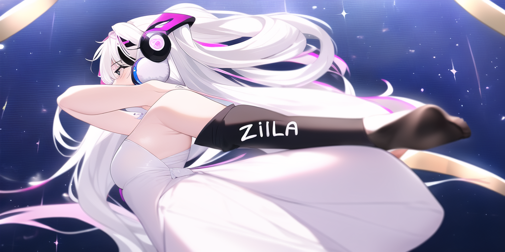

<h1 align="center"><strong><i>ZILLYA</i></strong></h1>

---

  

  

  

  

## Who is Zilya?

Once upon a time, two bots got smashed on the floor: Zouk and UTA.
The many particles smashed together created a great wonderful BOT called ZILYA.

## Credits
Image artist: **hakuran**